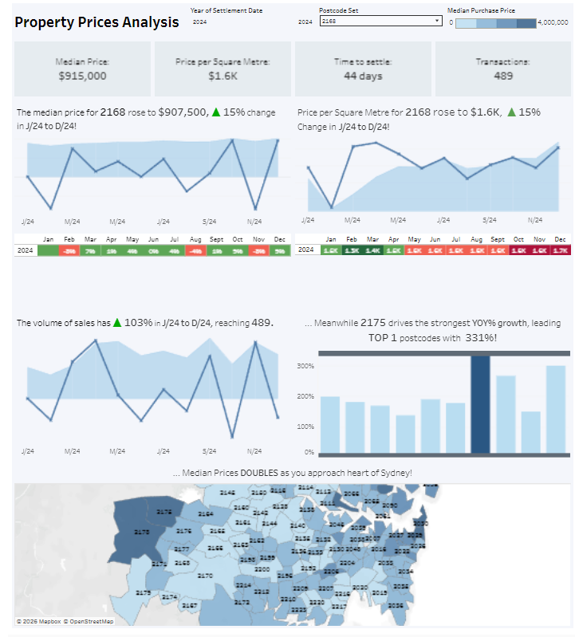

# Property Sales Analytics

Automated pipeline for scraping, converting, cleaning, and analyzing public housing sales data in Australia (2001–present).

This project demonstrates end-to-end data engineering and analytics skills: web scraping, data transformation, cleaning messy real-world datasets, and building interactive visualizations for property market insights.

## Dashboard Preview

Tableau Link: [Dashboard](https://public.tableau.com/app/profile/anthony.neav/viz/DashboardofPropertyPricesNSW/Dashboard1)

*(Interactive dashboard showing historical trends, suburb-level insights, and key metrics like median sale price, sales volume, and growth rates.)*

## Project Overview

Public housing sales data is often scattered across government websites in inconsistent formats (PDFs, CSVs, historical archives). This repository automates the extraction, standardization, and preparation of long-term property sales data, enabling trend analysis, price forecasting, suburb comparisons, and market insights.

Key features:
- Automated scraping of historical sales records
- Format conversion (e.g., PDF → structured data)
- Robust data cleaning and standardization
- Interactive dashboard for exploration and visualization

**Technologies used**
- Python
- Pandas & NumPy (data manipulation & cleaning)
- Tableau

## How It Works

1. **Scraping** — Collects historical property sales data from public sources (see below!)
2. **Conversion** (`converter.py`) — Transforms inconsistent formats (PDF tables, legacy CSVs) into clean, tabular data.
3. **Cleaning** (`Cleaner.py`) — Applies rigorous data quality steps:
   - Handle missing/invalid values
   - Standardize suburb names, addresses, property types
   - Correct date formats and outliers
   - Flag potential duplicates or errors
4. **Analysis & Visualization** — Load cleaned data into Tableau (or Python viz libraries) to create interactive dashboards showing:
   - Price trends over time
   - Median prices by suburb/year
   - Volume of sales
   - Regional comparisons

## Skills Demonstrated

- Web scraping & automation
- Data wrangling with large, messy, historical datasets
- ETL pipeline development
- Data quality & governance
- Interactive business intelligence (Tableau)
- Real-world application of data analytics to economic/property trends

## Data source
Kaggle Link: https://www.kaggle.com/datasets/anthonyneav1/australia-nsw-property-sales-dataset-cleaned

Government Public Sales: https://valuation.property.nsw.gov.au/embed/propertySalesInformation
